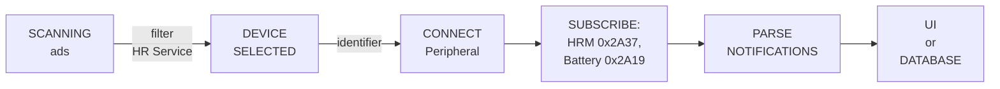
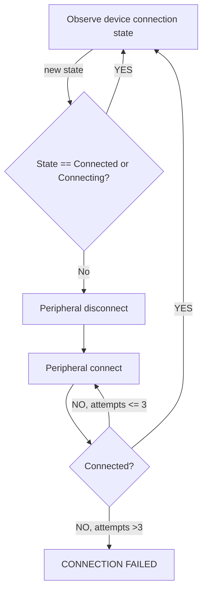
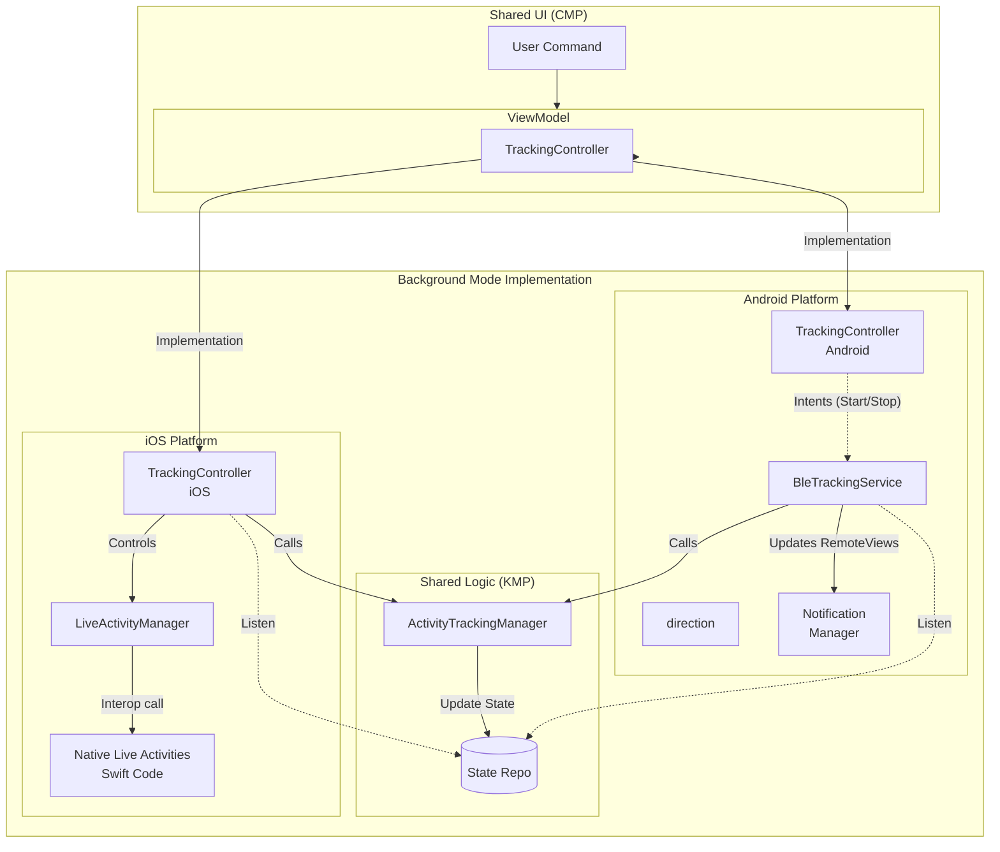

# HRAM: Heart Rate, Activity & Motion.

### Kotlin Multiplatform project targeting Android \& iOS

| **Android**                                                                                             | **iOS**                                                                                                 |
|---------------------------------------------------------------------------------------------------------|---------------------------------------------------------------------------------------------------------|
|  |  |

HRAM is a Kotlin Multiplatform app for heart rate \& activity tracking with BLE heart rate monitors.  
It uses Compose Multiplatform for shared UI, Kotlin Multiplatform for shared logic, Koin for DI, and an SQL
database for storing heart rate activities.

Tested with a Decathlon HRM Belt as an example device.

Status: **Work in progress / Prototype**

## ⚠️ **Disclaimer:**

No implied warranty or guarantee of functionality. Use at your own risk.  
This project is for educational purposes in software development only.
It is **not a medical application** and must **not be used for medical assessment, diagnosis, monitoring, or treatment**.

---

## Getting started

### Prerequisites

- macOS
- JDK 17\+
- Android Studio Otter 2 Feature Drop \| 2025\.2\.2 RC 2 or newer
- Xcode 26\+
- `git`

## Run targets

The project is currently under active development, and only a debug version of the application is available.

### Android

Open HRAM in Android Studio. Select the Android configuration for composeApp. Choose a
device/emulator. Run.
Useful tasks:

- `./gradlew :composeApp:assembleDebug`
- `./gradlew :composeApp:installDebug`

### iOS

1. Open iosApp/iosApp.xcodeproj in Xcode.
2. Select a simulator.
3. Run.

To create a build for a real device run in terminal:

`xcodebuild  -project iosApp/iosApp.xcodeproj -configuration Debug -scheme iosApp -sdk iphoneos  DEVELOPMENT_TEAM=“YOUR_DEVELOPMENT_TEAMID”  CODE_SIGN_STYLE=Automatic CODE_SIGN_IDENTITY="Apple Development" -verbose`

Just replace `YOUR_DEVELOPMENT_TEAMID` with your team ID.

---

## Testing

Unit tests for the shared logic are located in `composeApp/src/commonTest`. The project utilizes the following testing libraries:

- **`kotlin.test`**: For standard assertions.
- **`kotlinx-coroutines-test`**: For testing coroutine-based asynchronous code.
- [**`Mokkery`**](https://mokkery.dev/): For creating mocks and stubs of dependencies.

### Running Tests

To execute all tests in the `composeApp` module, run:

`./gradlew testDebugUnitTest`

To run a specific test class:

`./gradlew :composeApp:testDebugUnitTest --tests "com.achub.hram.ble.core.connection.HramConnectionTrackerTest"`

**Test coverage** is generated using [Kover](https://github.com/Kotlin/kotlinx-kover)
To generate an HTML coverage report, run the following command:

`./gradlew koverHtmlReport`

## Project description

HRAM focuses on:

- Discovering, connecting, and reading data from BLE heart rate devices.
- Tracking heart rate sessions basic info.
- Visualizing heart rate data using charts and indication views.
- Storing activity data in a local database.
- Sharing core logic (tracking, BLE, database, view models) between Android and iOS.

For compatibility, devices must implement the standard Heart Rate Service (UUID: 0x180D).

---

## Project structure

The project is organized into packages, with the core logic residing in `composeApp/src/commonMain`.

- `composeApp/src/commonMain/kotlin/com/achub/hram/`
    - `ble/` - BLE scanning, connection, and data handling.
    - `data/` - Database entities, DAOs, and activity repository.
    - `di/` - Koin dependency injection modules.
    - `screen/` - screens for each feature (Main, Activities, Record).
    - `tracking/` - Business logic for managing activity tracking sessions.
    - `view/` - Reusable UI components like charts and dialogs.

---

## Implemented features

### BLE

- BLE Layer is implemented in `hram/ble`:
    - The app communicates with BLE devices that implement the standard Heart Rate Service.
    - `BleDevice` model describing discovered devices; `identifier` field used for mac address (Android) or UUID (iOS).
    - `HrNotification` model for heart rate data (from the Heart Rate Measurement characteristic).
    - `BleNotification` encapsulates `HrNotification`, battery level, and BLE connection status.
    - Core components:
        - `BleConnectionManager`: Manages Bluetooth state, device scanning, and the connection lifecycle (
          connect/disconnect/reconnect).
        - `BleDataRepo`: Provides streams for BLE characteristic data (heart rate measurement, battery level).
        - `HrDeviceRepo`: A high-level repo that coordinates the `BleConnectionManager` and `BleDataRepo` to
          provide a unified interface for interacting with HR devices.

**What implemented:**

- Scanning for and managing BLE heart rate devices.
- Connecting to devices and receiving heart rate notifications.
- Reconnecting on disconnection with retry logic.
- Parsing low-level BLE data.

**BLE Connection and Data flow:**

**BLE reconnection flow:**

---

### Tracking

Tracking is implemented in `hram/tracking`:

- `ActivityTrackingManager` \- interface for activity tracking.
    - Start, pause, resume, stop tracking.
    - Integration with BLE data streams and activity repository.
    - Core stopwatch logic abstracted in `StopWatch`.

**What works:**

- Heart rate session lifecycle (start/pause/stop etc.).
- Time tracking for each session.
- Combined use of BLE data and stopwatch inside tracking manager.

---

### Background mode

**Implementation Details:**

Background execution is nuanced per platform. `TrackingController` is the central entry point found in `hram/tracking/TrackingController.kt`. It provides a unified interface but has platform-specific implementations that leverage the shared `ActivityTrackingManager` and reactive state repositories:

1.  **Android**:
    - Uses a **Foreground Service** (`BleTrackingService`) to keep the app alive.
    - `TrackingController` sends Intents to the service.
    - The Service delegates work to `ActivityTrackingManager` and observes shared state repositories to update **Notifications** (remote views).

2.  **iOS**:
    - Relies on iOS background modes (CoreBluetooth).
    - `TrackingController` delegates to `ActivityTrackingManager`.
    - `LiveActivityManager` observes shared state repositories and pushes updates to **Live Activities**.

---

### StateManagement

The app persists transient state (like current BLE connection status or active tracking session info) to survive process death or navigation.

**Packages:**
- `com.achub.hram.data.repo.state`: Repository interfaces and implementations for reactive state exposure.
- `com.achub.hram.data.store`: logic for serialization and storage (using DataStore).

**Key Components:**
- **BleStateRepo**: reflects the current state of BLE connection state(Disconnected, Connecting, Connected, etc.).
- **TrackingStateRepo**: Manages the state of the activity (Idle, Active, Paused).
- **DataStore**: Uses `BleStateSerializer` and `TrackingStateStageSerializer` to save state to disk asynchronously.

---

### Data layer & database

Located under `hram/data`:

- Activity repositories:
    - `HrActivityRepo` stores \& retrieves HR activities.
- Database:
    - `HramDatabase` in `hram/data/db`.
    - Heart rate and activity entities.
    - Queries to read \& write activity data.
    - Optimized heart rate aggregation per activity: splits sessions into time buckets and calculates average heart rate
      directly in the database for fast, efficient queries.

**What works:**

- Persisting activity data (heart rate sessions) locally.
- Querying history via the repository layer.

---

### UI \& screens

Common UI code lives under `hram/screen` and `hram/view`:

- Screens:
    - `screen/main`:
        - Entry Compose screen(s) for main app navigation.
    - `screen/activities`:
        - Screens for listing activities and viewing details (history).
        - `hram/view/chart` \- chart components for visualizing HR/metrics.
    - `screen/record`:
        - Screens for recording an activity (live HR, timer, etc.).

**What works:**

- Compose-based UI shared across platforms.
- Custom charts for heart rate data.
- Custom components using new Material 3 Expressive
- Localization support for English and Ukrainian.

**Activities Screen:**

| iOS                                                                                                     | Android                                                                                                 |
|---------------------------------------------------------------------------------------------------------|---------------------------------------------------------------------------------------------------------|
|  |  |

**Record Screen:**

| iOS                                                                                                     | Android                                                                                                 |
|---------------------------------------------------------------------------------------------------------|---------------------------------------------------------------------------------------------------------|
|  |  |

#### Notifications / Live Activities

To keep the user informed during a workout (even when the device is locked), the app uses platform-specific ongoing notifications:

- **Android**: Custom **Notifications** with `RemoteViews`.
    - Displays real-time heart rate.
    - Includes a "breathing" animation synced to the heart rate.

- **iOS**: **Live Activities** \& Dynamic Island.
    - Implemented using SwiftUI and WidgetKit.
    - Shows heart rate, session duration, and battery level on the Lock Screen and Dynamic Island.
    - Updates are pushed from the shared Kotlin code via `LiveActivityManager`.

---

### Dependency injection

Dependency injection is implemented using Koin under `hram/di`:

- `Koin.kt` \- starting point for DI initialization.
- `AppModule.kt` \- app-level bindings.
- `ViewModelModule.kt` \- registrations for view models.
- `TrackingModule.kt` \- bindings for tracking manager
- `BleModule.kt`, `BleDataModule.kt` in - BLE-specific bindings.
- `DatabaseModule.kt`, `DataModule.kt` in - database and repository bindings.
- `UtilsModule.kt` \- utility bindings.
- `DatabaseModule.kt` and `BleModule.kt` provide platform-specific implementations where needed.

---

## Tech stack

| Category                 | Technology                                                            |
|:-------------------------|:----------------------------------------------------------------------|
| **Language**             | Kotlin (Multiplatform), Swift (iOS Shell)                             |
| **UI**                   | Compose Multiplatform                                                 |
| **Architecture**         | MVVM, Repository Pattern                                              |
| **Dependency Injection** | Koin Annotations                                                      |
| **Permissions**          | [moko-permissions](https://github.com/icerockdev/moko-permissions)    |
| **Persistence**          | Room (KMP)                                                            |
| **BLE**                  | [Kable](https://github.com/JuulLabs/kable)                            |
| **Logging**              | [Napier](https://github.com/AAkira/Napier)                            |
| **Testing**              | kotlin.test, kotlinx-coroutines-test, [Mokkery](https://mokkery.dev/) |
| **Code Coverage**        | [Kover](https://github.com/Kotlin/kotlinx-kover)                      |

---

## Current limitations

- No external cloud sync/export.
- Limited error handling and UX for BLE edge cases.

## Video Demo: iOS - Android

https://github.com/user-attachments/assets/e88b0a23-735c-469a-849d-84a6222fd4a3

