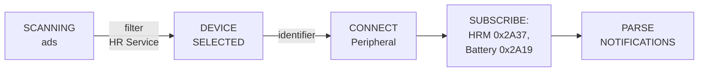

# HRAM: Heart Rate, Activity & Motion.

### Kotlin Multiplatform project targeting Android \& iOS

[PLACEHOLDER VIDEO/IMAGE]

HRAM is a Kotlin Multiplatform app for heart rate \& activity tracking with BLE heart rate monitors.  
It uses Compose Multiplatform for shared UI, Kotlin Multiplatform for shared logic, Koin for DI, and an SQL
database for storing heart rate activities.

Tested with a Decathlon HRM Belt as an example device.

Status: **Work in progress / Prototype**

## ⚠️ **Disclaimer:**

No implied warranty or guarantee of functionality. Use at your own risk.  
This project is for educational purposes in software development only.
It is **not a medical application** and must **not be used for medical assessment, diagnosis, monitoring, or treatment
**.

---

## 1. Project description

HRAM focuses on:

- Discovering, connecting, and reading data from BLE heart rate devices.
- Tracking heart rate sessions basic info.
- Visualizing heart rate data using Compose-based charts and indication views.
- Storing activity data in a local database.
- Sharing core logic (tracking, BLE, database, view models) between Android and iOS.

The app already contains a concrete implementation of BLE \& tracking layers and activity storage. 

For compatibility, devices must implement the standard Heart Rate Service (UUID: 0x180D).

---

## 2. Implemented features

### 2\.1 BLE

- BLE Layer is implemented in `hram/ble`:
    - The app communicates with BLE device which implements the standard Heart Rate Service.
    - `BleDevice` model describing discovered devices, `identifier` field used for mac address (
      Android) or UUID (iOS).
    - `HrIndication` model for heart rate data(Heart Rate Measurement characteristic).
    - `BleIndication` encapsulates `HrIndication`, battery level, bleConnection status and
      timestamp.
    - Repositories:
        - `BleConnectionRepo` : Bluetooth state, connection state, connect/disconnect, scanning.
        - `BleDataRepo` : ble characteristic data streams (heart rate measurement, battery level).
        - `HrDeviceRepo` : high level repo combining connection and data repos for heart rate devices.

**What implemented:**

- Scanning and managing BLE heart rate devices.
- Connecting to devices and receiving heart rate indications.
- Parsing low-level BLE data.

Below is a simplified flowchart of the BLE connection \& data flow:

---

### 2\.2 Tracking \& stopwatch

Tracking is implemented in `hram/tracking`:

- `ActivityTrackingManager` \- interface for activity tracking.
    - Start, pause, resume, stop tracking.
    - Integration with BLE data streams and activity repository.
    - Core stopwatch logic abstracted in `StopWatch`.

**What works:**

- Heart rate session lifecycle (start/pause/stop etc.).
- Time tracking for each session.
- Combined use of BLE data and stopwatch inside tracking manager.

---

### 2\.3 Data layer \& database

Located under `hram/data`:

- Activity repositories:
    - `HrActivityRepo` stores \& retrieves HR activities.
- Database:
    - `HramDatabase` in `hram/data/db`.
    - Heart rate and activity entities.
    - Queries to read \& write activity data.
    - Optimized heart rate aggregation per activity: splits sessions into time buckets and calculates average heart rate
      directly in the database for fast, efficient queries.

**What works:**

- Persisting activity data (heart rate sessions) locally.
- Querying history via the repository layer.

---

### 2\.4 UI \& screens

Common UI code lives under `hram/screen` and `hram/view`:

- Screens:
    - `screen/main`:
        - Entry Compose screen(s) for main app navigation.
    - `screen/activities`:
        - Screens for listing activities and viewing details (history).
        - `hram/view/chart` \- chart components for visualizing HR/metrics.
    - `screen/record`:
        - Screens for recording an activity (live HR, timer, etc.).

**What works:**

- Compose-based UI shared across platforms.
- Device list \& selection UI.
- Activity recording and visualization UI.
- Activity list/details UI.
- Custom charts for heart rate data.
- Custom components using new Material 3 Expressive
- Localization support for English and Ukrainian.

[PLACEHOLDER VIDEO/IMAGE]

---

### 2\.5 Dependency injection

Dependency injection is implemented using Koin under `hram/di`:

- `Koin.kt` \- starting point for DI initialization.
- `AppModule.kt` \- app-level bindings.
- `ViewModelModule.kt` \- registrations for view models.
- `TrackingModule.kt` \- bindings for tracking manager
- `BleModule.kt`, `BleDataModule.kt` in - BLE-specific bindings.
- `DatabaseModule.kt`, `DataModule.kt` in - database and repository bindings.
- `UtilsModule.kt` \- utility bindings.
- `DatabaseModule.kt` and `BleModule.kt` provide platform-specific implementations where needed.

---

## 3. Tech stack

- **Languages**
    - Kotlin (Multiplatform)
    - Swift (iOS shell in `iosApp`)
- **UI**
    - Compose Multiplatform (Compose for shared UI)
- **Architecture**
    - MVVM for UI Layer
    - Repository pattern for BLE and activities
    - DI via Koin
- **Permissions**
    - [moko-permissions](https://github.com/icerockdev/moko-permissions) for runtime permissions
      handling
- **Persistence**
    - Room (KMM version) for local database
- **BLE**
    - [kable](https://github.com/JuulLabs/kable) multiplatform ble library.
- **Logging**
    - [Napier](https://github.com/AAkira/Napier) for multiplatform logging.

---

## 4. Getting started

### 4\.1 Prerequisites

- macOS
- JDK 17\+
- Android Studio Otter 2 Feature Drop \| 2025\.2\.2 RC 2 or newer
- Xcode 26\+
- `git`

## 5. Run targets

### 5.1 Android

Open HRAM in Android Studio. Select the Android configuration for composeApp. Choose a
device/emulator. Run.
Useful tasks:

- `./gradlew :composeApp:assembleDebug`
- `./gradlew :composeApp:installDebug`

### 5.2 iOS

1. Open iosApp/iosApp.xcodeproj in Xcode.
2. Select a simulator or device.
3. Run.

## 6. Current limitations

- No background activity tracking is wired yet - tracking works while the app is active.
- No external cloud sync/export.
- Limited error handling and UX for BLE edge cases.

