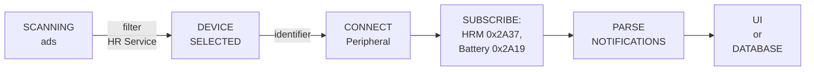
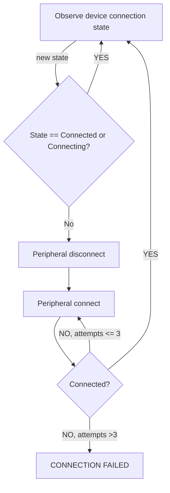
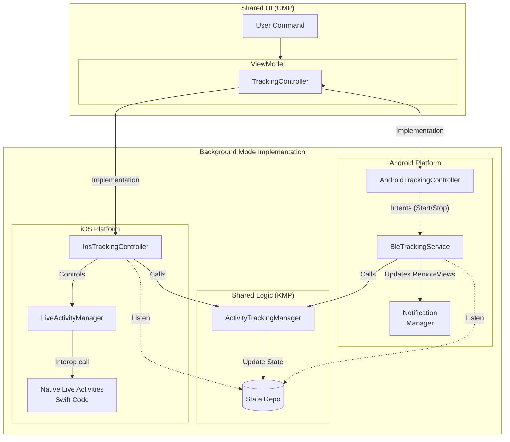

# HRAM: Heart Rate Activity Monitoring

### Kotlin Multiplatform project targeting Android \& iOS

| **Android**                                                                                             | **iOS**                                                                                                 |
|---------------------------------------------------------------------------------------------------------|---------------------------------------------------------------------------------------------------------|
|  |  |

HRAM is a Kotlin Multiplatform app for heart rate \& activity tracking with BLE heart rate
monitors.  
It uses Compose Multiplatform for shared UI, Kotlin Multiplatform for shared logic, Koin for DI, and
an SQL database for storing heart rate activities.

Tested with a Decathlon HRM Belt as an example device.

Status: **Work in progress / Prototype**

## ⚠️ **Disclaimer:**

No implied warranty or guarantee of functionality. Use at your own risk.  
This project is for educational purposes in software development only.
It is **not a medical application** and must **not be used for medical assessment, diagnosis,
monitoring, or treatment**.

---

## Getting started

### Prerequisites

- macOS
- JDK 17\+
- Android Studio Otter 2 Feature Drop \| 2025\.2\.2 RC 2 or newer
- Xcode 26\+
- `git`

## Run targets

The project is currently under active development, and only a debug version of the application is
available.

### Android

Open HRAM in Android Studio. Select the Android configuration for androidApp. Choose a
device/emulator. Run.
Useful tasks:

- `./gradlew :androidApp:assembleDebug`
- `./gradlew :androidApp:installDebug`

### iOS

Open HRAM in Android Studio. Select the iOS configuration for iosApp. Choose a
device/emulator. Run.

#### Scripts

`/scripts` - This directory contains shell scripts for building the iOS application.

#### build-framework.sh

Builds the Compose Multiplatform framework for iOS.

**Usage:**

```bash
./scripts/build-framework.sh [SDK] [CONFIGURATION]
```

**Parameters:**

- `SDK` (default: `iphonesimulator`): Target SDK - `iphonesimulator` or `iphoneos`
- `CONFIGURATION` (default: `Debug`): Build configuration

**Examples:**

```bash
./scripts/build-framework.sh iphonesimulator Debug
./scripts/build-framework.sh iphoneos
./scripts/build-framework.sh  # Uses defaults
```

**Output:**

- Framework location: `shared/app-di/build/xcode-frameworks/{CONFIGURATION}/{SDK}/ComposeApp.framework`

---

#### build-xcode.sh

Builds the iOS Xcode project.

**Usage:**

```bash
./scripts/build-xcode.sh [SDK] [CONFIGURATION] [SIMULATOR_NAME]
```

**Parameters:**

- `SDK` (default: `iphonesimulator`): Target SDK - `iphonesimulator` or `iphoneos`
- `CONFIGURATION` (default: `Debug`): Build configuration
- `SIMULATOR_NAME` (default: `iPhone 17`): Simulator device name (only used for iphonesimulator)

**Examples:**

```bash
./scripts/build-xcode.sh iphonesimulator Debug "iPhone 17"
./scripts/build-xcode.sh iphoneos Debug
./scripts/build-xcode.sh  # Uses defaults
```

**Output:**

- App location: `./build/ios-{SDK}/Build/Products/{CONFIGURATION}-{SDK}/`

---

#### Complete Build Process

To build the complete iOS application, run both scripts in sequence:

```bash
# Build the framework
./scripts/build-framework.sh iphonesimulator Debug

# Build the Xcode project
./scripts/build-xcode.sh iphonesimulator Debug "iPhone 17"
```

---

## Testing

Unit tests for the shared logic are located in `shared/presentation/src/commonTest` and
`shared/libs/ble/src/commonTest`.
The project utilises the following testing libraries:

- **`kotlin.test`**: For standard assertions.
- **`kotlinx-coroutines-test`**: For testing coroutine-based asynchronous code.
- [**`Mokkery`**](https://mokkery.dev/): For creating mocks and stubs of dependencies.

### Running Tests

To execute all tests, run:

`./gradlew testDebugUnitTest`

To run BLE module tests:

`./gradlew :ble:testAndroidHostTest`

To run a specific test class:

`./gradlew :ble:testAndroidHostTest --tests "com.achub.hram.ble.core.connection.HramConnectionTrackerTest"`

**Test coverage** is generated using [Kover](https://github.com/Kotlin/kotlinx-kover).
To generate an HTML coverage report, run the following command:

`./gradlew koverHtmlReport`

## Project description

HRAM focuses on:

- Discovering, connecting, and reading data from BLE heart rate devices.
- Tracking heart rate sessions basic info.
- Visualizing heart rate data using charts and indication views.
- Storing activity data in a local database.
- Exporting activity data to CSV files.
- Sharing core logic (tracking, BLE, database, view models) and UI between Android and iOS.

For compatibility, devices must implement the standard Heart Rate Service (UUID: 0x180D).

---

## Project structure

The project is organized into modules under `shared/`, a shell per platform, and a
`build-logic/` convention plugin for reusable KMP build configuration.

```
HRAM/
├── shared/
│   ├── libs/
│   │   ├── ble/       # Standalone BLE library (Koin-free)
│   │   ├── ui-lib/    # Reusable Compose components, styles, shaders
│   │   └── logger/    # Napier wrapper — Logger object shared across all modules
│   ├── domain/        # Business logic, interfaces, use cases
│   ├── data/          # Room DB, DataStore, repositories, export
│   ├── presentation/  # Compose screens, ViewModels, platform DI
│   └── app-di/        # Koin root — produces ComposeApp.framework for iOS
├── androidApp/        # Android shell (MainActivity + HramApp)
├── iosApp/            # iOS shell (SwiftUI + Live Activity + Swift bridge)
└── build-logic/       # Gradle convention plugins + :annotations module
```

### `build-logic/`

Gradle convention plugins and the shared `:annotations` KMP module:

- `convention/` — Precompiled script plugins:
    - `kmp-library-convention` — Base KMP multiplatform library setup.
    - `cmp-ui-lib-convention` — Extends `kmp-library-convention` with Compose Multiplatform plugins
      and common Compose dependencies; used by `:ui-lib` and `:presentation`.
    - `koin-convention` — Koin DI + KSP wiring.
    - `quality-convention` — Detekt + Kover. Applied to all library modules.
    - `test-mocking-convention` — Mokkery + `allOpen`. Opt-in for modules that use mocks in tests.
      Registers `@OpenForMokkery` with the `allOpen` compiler plugin — no per-module configuration
      needed.
- `annotations/` — `:annotations` KMP module. Contains `OpenForMokkery.kt` — the
  `@Retention(SOURCE)` annotation that marks classes to be opened by the `allOpen` plugin for
  Mokkery mocking. Exposed as `api` in `test-mocking-convention` so it is available on all
  platforms including Kotlin/Native.

### `shared/libs/`

Library modules shared across feature modules. None of them apply `koin-convention`; they are
pure KMP libraries consumed as dependencies.

### `shared/libs/logger/`

Thin Napier wrapper. All other modules use `Logger` instead of importing Napier directly.

- `Logger.D(tag, message)` — debug log.
- `Logger.E(tag, message)` — error log.
- `Logger.init()` — attaches `DebugAntilog`; called once from `initKoin()` in `:app-di`.

Automatically available in every KMP module via `api(project(":logger"))` in
`kmp-library-convention` — no per-module declaration needed.

### `shared/libs/ble/`

Standalone BLE module. Koin-free — no DI wiring inside.

- `src/commonMain/` — Shared BLE interfaces and implementations.
- `src/androidMain/` — Android Bluetooth state observer (`BluetoothStateAndroid`).
- `src/iosMain/` — iOS CoreBluetooth state observer (`BluetoothStateIos`).
- `src/commonTest/` — BLE unit tests.

Key classes:

| Class / Interface        | Purpose                                                              |
|--------------------------|----------------------------------------------------------------------|
| `BleConnectionManager`   | Bluetooth state, scanning, connect/disconnect/reconnect lifecycle    |
| `BleDataRepo`            | Characteristic data streams (heart rate, battery)                   |
| `HrDeviceRepo`           | High-level facade over `BleConnectionManager` + `BleDataRepo`       |
| `BleDevice`              | Discovered device — `identifier` is MAC on Android, UUID on iOS     |
| `BleNotification`        | Encapsulates `HrNotification`, battery level, and connection status |

### `shared/domain/`

Business logic, interfaces, and shared models. No platform code.

| Package / File                     | Purpose                                                         |
|------------------------------------|-----------------------------------------------------------------|
| `domain/model/`                    | Domain models (`DeviceModel`, `ActivityInfo`, `HrBucket`, …)   |
| `tracking/ActivityTrackingManager` | Interface + `HramActivityTrackingManager` implementation        |
| `tracking/StopWatch`               | Stopwatch abstraction for session time tracking                 |
| `tracking/TrackingController`      | Interface dispatched to platform implementations                |
| `usecase/ExportCsvUseCase`         | Fetches HR records and formats them as CSV                      |
| `data/repo/`                       | Repository interfaces (`HrActivityRepo`, `BleStateRepo`, …)    |
| `export/FileExporter`              | Platform interface for writing files to device storage          |
| `di/`                              | `TrackingModule`, `CoroutineModule`, `Qualifiers`               |
| `ext/DomainExtensions`             | Shared extension functions (`now()`, time helpers)      |

### `shared/data/`

Data layer — Room database, DataStore, repository implementations, and CSV export.

| Package / File               | Purpose                                                                      |
|------------------------------|------------------------------------------------------------------------------|
| `data/db/`                   | `HramDatabase`, `ActivityEntity`, `HeartRateBleEntity`, DAOs                 |
| `data/repo/`                 | `HramHrActivityRepo`, `HramBleStateRepo`, `HramTrackingStateRepo`            |
| `data/store/`                | DataStore serializers (`BleStateSerializer`, `TrackingStateStageSerializer`) |
| `data/mapper/`               | Mappers between entities and domain models                                   |
| `export/`                    | `AndroidFileExporter`, `IosFileExporter`                                     |
| `di/`                        | `BleDataModule`, `BleModule` (expect/actual), `DatabaseModule` (expect/actual), `DataModule`, `DataStoreModule` (expect/actual), `SerializerModule`, `ExportModule` (expect/actual) |

### `shared/presentation/`

Shared Compose UI, ViewModels, and platform-specific tracking controllers.

- `src/commonMain/` — Screens, ViewModels, DI modules.
- `src/androidMain/` — `AndroidTrackingController`, `BleTrackingService`, `Notificator`, Android DI.
- `src/iosMain/` — `IosTrackingController`, `LiveActivityManager`, `BleStateType`, iOS DI.
- `src/commonTest/` — Shared unit tests.

| Package / File                       | Purpose                                                           |
|--------------------------------------|-------------------------------------------------------------------|
| `screen/main/`                       | Main screen, bottom tab navigation                                |
| `screen/activities/`                 | Activities list screen + ViewModel                                |
| `screen/record/`                     | Live recording screen + ViewModel                                 |
| `tracking/AndroidTrackingController` | Sends Intents to `BleTrackingService`                             |
| `tracking/IosTrackingController`     | Calls `ActivityTrackingManager` and `LiveActivityManager` directly |
| `tracking/BleTrackingService`        | Android foreground service for background BLE tracking            |
| `tracking/Notificator`               | Android persistent notification with `RemoteViews`                |
| `tracking/LiveActivityManager`       | iOS — pushes updates to WidgetKit Live Activities                 |
| `di/`                                | `ViewModelModule`, `UtilsModule`, `TrackingPlatformModule` (expect/actual), `NotificationModule` (Android) |

### `shared/libs/ui-lib/`

Reusable Compose UI library — styles, components, shaders, charts.

- `style/` — Colors, dimensions, text styles.
- `models/` — UI-layer DTOs (`BleNotificationUi`, `DeviceUi`, `HrNotificationUi`,
  `GraphLimitsUi`, `HighlightedItemUi`).
- `view/cards/` — Activity card, graph info, aggregated HR bucket components.
- `view/chart/` — Chart components for visualising HR/metrics.
- `view/components/` — Buttons, text fields, progress indicators, heart animation, floating
  toolbar, custom ripple, dialog primitives.
- `view/dialogs/` — Info, name-activity, and BLE device chooser dialogs.
- `view/indications/` — Heart indication row, warning labels.
- `view/section/` — Record, device, and tracking indication sections.
- `view/shader/` — AGSL-based Liquid Ripple and Liquid Wave effects (expect/actual).
- `view/tabs/` — Bottom navigation bar with liquid ripple tab indicator.
- `ext/` — Time and view extension functions.
- `utils/` — Date utilities, lifecycle helpers.
- `composeResources/` — All string resources (EN/UK), drawables, AGSL shader files.

### `shared/app-di/`

Koin root module. Entry point: `di/Koin.kt`.

- Aggregates all DI modules from `:presentation`, `:data`, and `:domain`.
- For iOS, produces the `ComposeApp.framework` (static, exports `:presentation`, `:data`,
  `:domain` so their types are visible in Swift).

### `androidApp/`

Android application shell. Depends on `:app-di`.

- `MainActivity` — single Activity, hosts the Compose UI.
- `HramApp` — `Application` subclass, initialises Koin.

### `iosApp/`

iOS application shell.

- `iosApp/` — SwiftUI entry point (`iOSApp.swift`, `ContentView.swift`).
- `Bridge/LiveActivityBridge.swift` — C-interop bridge: Kotlin calls `startLiveActivity` /
  `updateLiveActivity` / `endLiveActivity` via `@_cdecl`.
- `HramLiveActivity/` — Live Activity + Dynamic Island UI (SwiftUI + WidgetKit).
- `Configuration/` — Xcode build configuration files.

---

## Implemented features

### BLE

- BLE Layer is implemented in the standalone `:ble` module (`shared/libs/ble/`):
    - The app communicates with BLE devices that implement the standard Heart Rate Service.
    - `BleDevice` model describing discovered devices; `identifier` field used for mac address (
      Android) or UUID (iOS).
    - `HrNotification` model for heart rate data (from the Heart Rate Measurement characteristic).
    - `BleNotification` encapsulates `HrNotification`, battery level, and BLE connection status.
    - Core components:
        - `BleConnectionManager`: Manages Bluetooth state, device scanning, and the connection
          lifecycle (connect/disconnect/reconnect).
        - `BleDataRepo`: Provides streams for BLE characteristic data (heart rate measurement,
          battery level).
        - `HrDeviceRepo`: A high-level repo that coordinates the `BleConnectionManager` and
          `BleDataRepo` to provide a unified interface for interacting with HR devices.

**What implemented:**

- Scanning for and managing BLE heart rate devices.
- Connecting to devices and receiving heart rate notifications.
- Reconnecting on disconnection with retry logic.
- Parsing low-level BLE data.

**BLE Connection and Data flow:**


```mermaid
flowchart LR
    A["SCANNING <br> ads"] -->|filter<br>HR Service| B[DEVICE<br>SELECTED]
    B -->|identifier| C[CONNECT<br>Peripheral]
    C --> D[SUBSCRIBE:<br>HRM 0x2A37,<br>Battery 0x2A19]
    D --> E[PARSE<br>NOTIFICATIONS]
    E --> F[UI<br>or<br>DATABASE]
```

**BLE reconnection flow:**


```mermaid
flowchart TD
    A[Observe device connection state] --> |new state| B{State == Connected or Connecting?}
    B -->|YES| A
    B -->|No| D[Peripheral disconnect]
    D --> E[Peripheral connect]
    E --> F{Connected?}
    F -->  |YES| A
    F -->  |NO, attempts <= 3| E
    F -->  |NO, attempts >3| G[CONNECTION FAILED]
```

---

### Tracking

Tracking is implemented in the `:domain` module (`shared/domain/`):

- `ActivityTrackingManager` \- interface for activity tracking.
    - Start, pause, resume, stop tracking.
    - Integration with BLE data streams and activity repository.
    - Core stopwatch logic abstracted in `StopWatch`.

**What works:**

- Heart rate session lifecycle (start/pause/stop etc.).
- Time tracking for each session.
- Combined use of BLE data and stopwatch inside tracking manager.

---

### Background mode

**Implementation Details:**

Background execution is nuanced per platform. `TrackingController` is the central entry point,
defined as an interface in `:domain` (`shared/domain/tracking/TrackingController.kt`). It provides
a unified interface but has platform-specific implementations in `:presentation` that leverage the
shared `ActivityTrackingManager` and reactive state repositories:

1. **Android**:
    - Uses a **Foreground Service** (`BleTrackingService`) to keep the app alive.
    - `AndroidTrackingController` sends Intents to the service.
    - The Service delegates work to `ActivityTrackingManager` and observes shared state repositories
      to update **Notifications** (remote views).

2. **iOS**:
    - Relies on iOS background modes (CoreBluetooth).
    - `IosTrackingController` delegates to `ActivityTrackingManager`.
    - `IosTrackingController` observes shared state repositories and calls `LiveActivityManager` to
      push updates to **Live Activities**.


```mermaid

flowchart TB
    %% Shared UI
    subgraph Shared CMP ["Shared UI (CMP)"]
        direction TB
        UI[User Command]
        subgraph VM[ViewModel]
            TC_Shared[TrackingController]
        end

        VM --> TC_Shared
        UI --> VM
    end
      
    %% Background Mode
    subgraph BG[Background Mode Implementation]
        direction LR
        %% Android Platform
        subgraph Android ["Android Platform"]
            TC_And[AndroidTrackingController]
            Service[BleTrackingService]
              Notif[Notification <br> Manager]
          
            Service -- "Updates RemoteViews" --> Notif
        end

        %% Shared KMP
        subgraph Shared ["Shared Logic (KMP)"]
            VM[ViewModel]
            TC_Shared[TrackingController]
            ATM[ActivityTrackingManager]
            Repos[(State Repo)]

            ATM -- "Update State" --> Repos
        end

        %% iOS Platform
        subgraph iOS ["iOS Platform"]
            LAM[LiveActivityManager]
            LA[Native Live Activities <br> Swift Code]
            TC_iOS[IosTrackingController]

            TC_iOS -- "Controls" --> LAM
            LAM -- "Interop call" --> LA
        end
    end

    %% Cross-layer connections
    TC_Shared -- "Implementation" --> TC_And
    TC_Shared -- "Implementation" --> TC_iOS
    Service -- "Calls" --> ATM
    TC_iOS -- "Calls" --> ATM
    Service -. "Listen" .-> Repos
    TC_iOS -. "Listen" .-> Repos
    TC_And -. "Intents (Start/Stop)" .-> Service
```

---

### Data layer & database

Located in the `:data` module (`shared/data/`):

- Activity repositories:
    - `HramHrActivityRepo` stores \& retrieves HR activities.
- Database:
    - `HramDatabase` in `data/db`.
    - Heart rate (`HeartRateBleEntity`) and activity (`ActivityEntity`) entities.
    - DAOs: `HeartRateDao`, `ActivityDao`.
    - Queries to read \& write activity data.
    - Optimised heart rate aggregation per activity: splits sessions into time buckets and
      calculates average heart rate directly in the database for fast, efficient queries.

**What works:**

- Persisting activity data (heart rate sessions) locally.
- Querying history via the repository layer.

#### State Management

The app persists transient state (like current BLE connection status or active tracking session
info) to survive process death or navigation.

**Packages:**

- `com.achub.hram.data.repo.state`: Repository interfaces and implementations for reactive state
  exposure.
- `com.achub.hram.data.store`: Serialization and storage logic (using DataStore).

**Key Components:**

- **BleStateRepo**: reflects the current state of BLE connection (Disconnected, Connecting,
  Connected, etc.).
- **TrackingStateRepo**: Manages the state of the activity (Idle, Active, Paused).
- **DataStore**: Uses `BleStateSerializer` and `TrackingStateStageSerializer` to save state to disk
  asynchronously.

---

---

### UI \& screens

Shared UI lives in the `:ui-lib` module (`shared/libs/ui-lib/`) and app-specific screens in
`:presentation` (`shared/presentation/src/commonMain/kotlin/com/achub/hram/screen/`):

- **`:ui-lib`** — all reusable components, styles, shaders, charts, dialogs, sections, tabs.
    - `style/` — Colors, dimensions, text styles.
    - `models/` — UI-layer DTOs (`BleNotificationUi`, `DeviceUi`, `HrNotificationUi`,
      `GraphLimitsUi`, `HighlightedItemUi`).
    - `view/cards/` — Activity card, graph info, aggregated HR bucket components.
    - `view/chart/` — Chart components for visualising HR/metrics.
    - `view/components/` — Buttons, text fields, progress indicators, heart animation, floating
      toolbar, custom ripple, dialog primitives.
    - `view/dialogs/` — Info, name-activity, and BLE device chooser dialogs.
    - `view/indications/` — Heart indication row, warning labels.
    - `view/section/` — Record, device, and tracking indication sections.
    - `view/shader/` — AGSL-based Liquid Ripple and Liquid Wave effects (expect/actual).
    - `view/tabs/` — Bottom navigation bar with liquid ripple tab indicator.
    - `ext/` — Time and view extension functions.
    - `utils/` — Date utilities, lifecycle helpers.
    - `composeResources/` — All string resources (EN/UK), drawables, AGSL shader files.
- **`:presentation`/`screen/`** — Screens for each feature (Main, Activities, Record).

**What works:**

- Compose-based UI shared across platforms.
- Custom charts for heart rate data.
- Custom AGSL shaders for visual effects (Liquid Ripple for Bottom Bar, Liquid Wave for Heart
  animation).
- Custom components using new Material 3 Expressive
- Localization support for English and Ukrainian.

**Activities Screen:**

| iOS                                                                                                     | Android                                                                                                 |
|---------------------------------------------------------------------------------------------------------|---------------------------------------------------------------------------------------------------------|
|  |  |

**Record Screen:**

| iOS                                                                                                     | Android                                                                                                 |
|---------------------------------------------------------------------------------------------------------|---------------------------------------------------------------------------------------------------------|
|  |  |

#### Notifications / Live Activities

To keep the user informed during a workout (even when the device is locked), the app uses
platform-specific ongoing notifications:

- **Android**: Custom **Notifications** with `RemoteViews`.
    - Displays real-time heart rate.
    - Includes a "breathing" animation synced to the heart rate.

- **iOS**: **Live Activities** \& Dynamic Island.
    - Implemented using SwiftUI and WidgetKit.
    - Shows heart rate, session duration, and battery level on the Lock Screen and Dynamic Island.
    - Updates are pushed from the shared Kotlin code via `LiveActivityManager`.

| iOS                                                                                                     | Android                                                                                                 |
|---------------------------------------------------------------------------------------------------------|---------------------------------------------------------------------------------------------------------|
|  |  |

| Dynamic Island on iOS                                                                                                              |
|------------------------------------------------------------------------------------------------------------------------------------
|  |
|  |
|  |

---

### Export

Activity data can be exported to CSV files from the Activities screen toolbar (single-activity
selection). The export pipeline is:

- `ExportCsvUseCase` (`:domain`) — fetches all `HeartRateEntity` records for the selected activity
  and formats them as CSV (timestamp, elapsed time, heart rate, contact status, battery level).
- `FileExporter` (`:domain`) — platform interface with `AndroidFileExporter` and `IosFileExporter`
  implementations (`:data`) for writing the file to the device's shared/documents directory.
- `ExportModule` (`:data`) — `expect/actual` Koin module that binds the correct `FileExporter`
  implementation per platform.

---

### CI / GitHub Actions

The project uses GitHub Actions for continuous integration:

- `android-build.yml` — Builds the Android debug APK.
- `ios-build.yml` — Builds the iOS simulator app via `build-framework.sh` + `build-xcode.sh`.
- `unit-tests.yml` — Runs unit tests and generates a Kover coverage report (80% minimum).
- `detekt-analysis.yml` — Runs Detekt static analysis.
- `pull-request.yml` — Orchestrates all checks on PRs to `main` and posts a summary comment.

---

### Dependency injection

Dependency injection is implemented using Koin with KSP annotations. Modules are split across
layers:

**`:domain`**
- `TrackingModule.kt` — bindings for `ActivityTrackingManager` and `StopWatch`.
- `CoroutineModule.kt` — coroutine dispatcher bindings.

**`:data`**
- `BleDataModule.kt` — `HrDeviceRepo` and BLE data bindings.
- `BleModule.kt` (expect/actual) — platform-specific BLE scanner/connector setup.
- `DatabaseModule.kt` (expect/actual) — Room database setup.
- `DataModule.kt` — repository bindings.
- `DataStoreModule.kt` (expect/actual) — DataStore setup.
- `SerializerModule.kt` — serialization bindings.
- `ExportModule.kt` (expect/actual) — `FileExporter` implementation binding.

**`:presentation`**
- `ViewModelModule.kt` — ViewModel registrations.
- `UtilsModule.kt` — utility bindings.
- `TrackingPlatformModule.kt` (expect/actual) — binds `AndroidTrackingController` or
  `IosTrackingController`.
- `NotificationModule.kt` (Android only) — notification manager bindings.

**`:app-di`**
- `AppModule.kt` — top-level Koin module aggregating all sub-modules.
- `Koin.kt` — `initKoin()` entry point called from both `HramApp` (Android) and `InitHelper`
  (iOS).

---

## Tech stack

| Category                 | Technology                                                            |
|:-------------------------|:----------------------------------------------------------------------|
| **Language**             | Kotlin (Multiplatform), Swift (iOS Shell)                             |
| **UI**                   | Compose Multiplatform                                                 |
| **Architecture**         | MVVM, Repository Pattern                                              |
| **Dependency Injection** | Koin Annotations                                                      |
| **Permissions**          | [moko-permissions](https://github.com/icerockdev/moko-permissions)    |
| **Persistence**          | Room (KMP), DataStore                                                 |
| **Serialization**        | kotlinx-serialization, Okio                                           |
| **BLE**                  | [Kable](https://github.com/JuulLabs/kable)                           |
| **Logging**              | [Napier](https://github.com/AAkira/Napier) (wrapped by `:logger`)    |
| **Testing**              | kotlin.test, kotlinx-coroutines-test, [Mokkery](https://mokkery.dev/) |
| **Code Coverage**        | [Kover](https://github.com/Kotlin/kotlinx-kover)                     |
| **Static Analysis**      | [Detekt](https://detekt.dev/)                                         |
| **CI**                   | GitHub Actions                                                        |

---

## Current limitations

- No external cloud sync.
- Limited error handling and UX for BLE edge cases.

## Video Demo: iOS - Android

https://github.com/user-attachments/assets/873f56e3-3539-4111-abcf-27ce0266e24d
