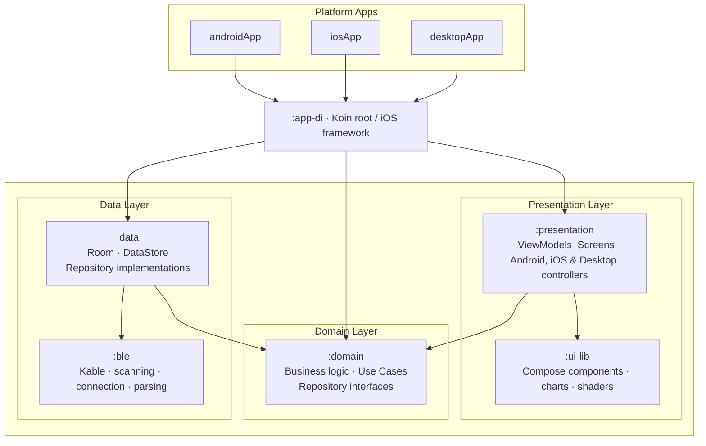
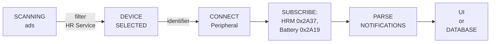
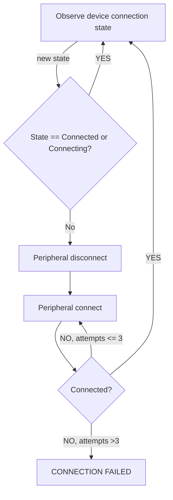
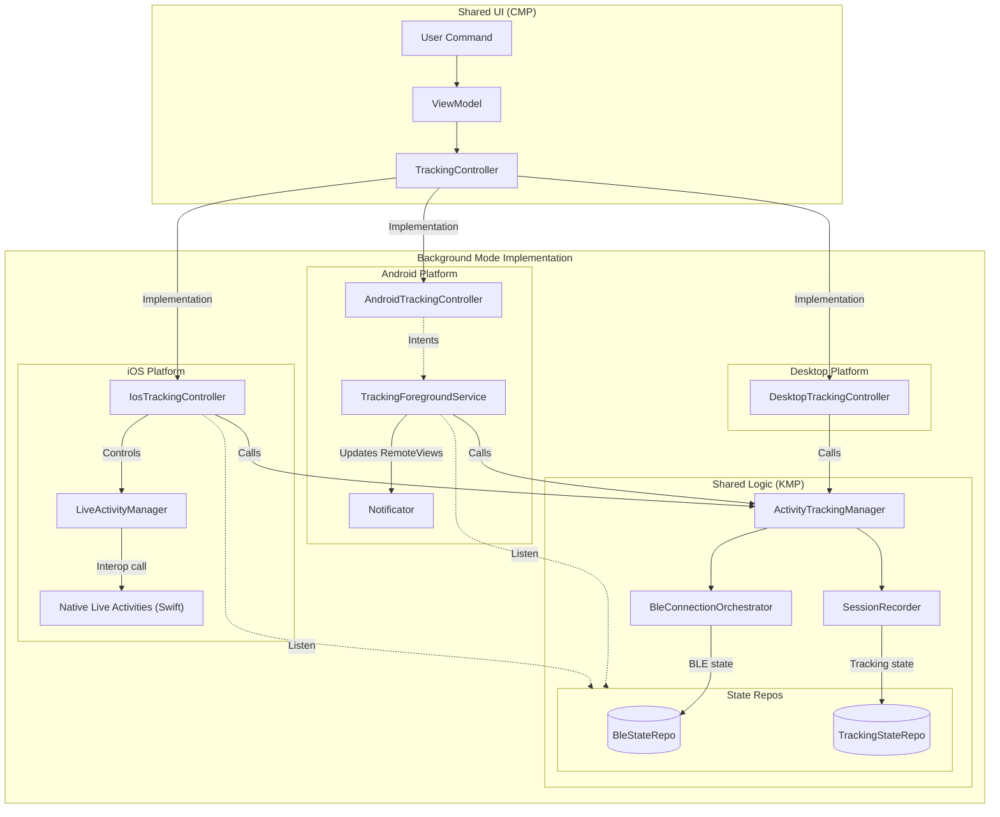

# HRAM: Heart Rate Activity Monitoring

### Kotlin Multiplatform project targeting Android, iOS & Desktop (macOS)

| **Android**                                                                                             | **iOS**                                                                                                 |
|---------------------------------------------------------------------------------------------------------|---------------------------------------------------------------------------------------------------------|
|  |  |

HRAM is a Kotlin Multiplatform app for heart rate \& activity tracking with BLE heart rate
monitors.  
It uses Compose Multiplatform for shared UI, Kotlin Multiplatform for shared logic, Koin for DI, and
an SQL database for storing heart rate activities. Runs on **Android**, **iOS**, and **macOS Desktop**.

Tested with a Decathlon HRM Belt as an example device.

Status: **Work in progress / Prototype**

## ⚠️ **Disclaimer:**

No implied warranty or guarantee of functionality. Use at your own risk.  
This project is for educational purposes in software development only.
It is **not a medical application** and must **not be used for medical assessment, diagnosis,
monitoring, or treatment**.

---

## Getting started

### Prerequisites

- macOS
- JDK 17\+
- Android Studio Otter 2 Feature Drop \| 2025\.2\.2 RC 2 or newer
- Xcode 26\+
- `git`

## Run targets

The project is currently under active development, and only a debug version of the application is
available.

### Android

Open HRAM in Android Studio. Select the Android configuration for androidApp. Choose a
device/emulator. Run.
Useful tasks:

- `./gradlew :androidApp:assembleDebug`
- `./gradlew :androidApp:installDebug`

### iOS

Open HRAM in Android Studio. Select the iOS configuration for iosApp. Choose a
device/emulator. Run.

#### Scripts

`/scripts` - This directory contains shell scripts for building the iOS application.

#### build-framework.sh

Builds the Compose Multiplatform framework for iOS.

**Usage:**

```bash
./scripts/build-framework.sh [SDK] [CONFIGURATION]
```

**Parameters:**

- `SDK` (default: `iphonesimulator`): Target SDK - `iphonesimulator` or `iphoneos`
- `CONFIGURATION` (default: `Debug`): Build configuration

**Examples:**

```bash
./scripts/build-framework.sh iphonesimulator Debug
./scripts/build-framework.sh iphoneos
./scripts/build-framework.sh  # Uses defaults
```

**Output:**

- Framework location: `shared/app-di/build/xcode-frameworks/{CONFIGURATION}/{SDK}/ComposeApp.framework`

---

#### build-xcode.sh

Builds the iOS Xcode project.

**Usage:**

```bash
./scripts/build-xcode.sh [SDK] [CONFIGURATION] [SIMULATOR_NAME]
```

**Parameters:**

- `SDK` (default: `iphonesimulator`): Target SDK - `iphonesimulator` or `iphoneos`
- `CONFIGURATION` (default: `Debug`): Build configuration
- `SIMULATOR_NAME` (default: `iPhone 17`): Simulator device name (only used for iphonesimulator)

**Examples:**

```bash
./scripts/build-xcode.sh iphonesimulator Debug "iPhone 17"
./scripts/build-xcode.sh iphoneos Debug
./scripts/build-xcode.sh  # Uses defaults
```

**Output:**

- App location: `./build/ios-{SDK}/Build/Products/{CONFIGURATION}-{SDK}/`

---

#### Complete Build Process

To build the complete iOS application, run both scripts in sequence:

```bash
# Build the framework
./scripts/build-framework.sh iphonesimulator Debug

# Build the Xcode project
./scripts/build-xcode.sh iphonesimulator Debug "iPhone 17"
```

---

### Desktop (macOS)

Run the Compose Desktop app directly from the terminal or Android Studio:

```bash
# Run
./gradlew :desktopApp:run

# Package a distributable DMG
./gradlew :desktopApp:packageDmg
```

**Output:** `desktopApp/build/compose/binaries/main/dmg/HRAM-1.0.0.dmg`

The window has a minimum size of **800 × 600** and uses the `hram.icns` icon for the Dock and
packaged app bundle. Bluetooth state is read via IOBluetooth (JNA) — no Android or iOS system APIs
are used.

---

## Testing

Unit tests for the shared logic are located in `shared/presentation/src/commonTest` and
`shared/libs/ble/src/commonTest`.
The project utilises the following testing libraries:

- **`kotlin.test`**: For standard assertions.
- **`kotlinx-coroutines-test`**: For testing coroutine-based asynchronous code.
- [**`Mokkery`**](https://mokkery.dev/): For creating mocks and stubs of dependencies.

### Running Tests

To execute all tests, run:

`./gradlew testDebugUnitTest`

To run BLE module tests:

`./gradlew :ble:testAndroidHostTest`

To run a specific test class:

`./gradlew :ble:testAndroidHostTest --tests "com.achub.hram.ble.core.connection.HramConnectionTrackerTest"`

**Test coverage** is generated using [Kover](https://github.com/Kotlin/kotlinx-kover).
To generate an HTML coverage report, run the following command:

`./gradlew koverHtmlReport`

## Project description

HRAM focuses on:

- Discovering, connecting, and reading data from BLE heart rate devices.
- Tracking heart rate sessions basic info.
- Visualizing heart rate data using charts and indication views.
- Storing activity data in a local database.
- Exporting activity data to CSV files.
- Sharing core logic (tracking, BLE, database, view models) and UI between Android, iOS, and Desktop.

For compatibility, devices must implement the standard Heart Rate Service (UUID: 0x180D).

---

## Clean Architecture

HRAM follows Clean Architecture with three concentric layers. The core rule is that **dependencies
always point inward** — Presentation and Data both depend on Domain; Domain depends on neither.

### Layers

**Domain** (`:domain`) — the stable core. Pure Kotlin, zero framework or platform dependencies.
Owns all business logic:

- `ActivityTrackingManager`, `BleConnectionOrchestrator`, `SessionRecorder` — tracking orchestration.
- Use cases (`ExportCsvUseCase`, `ObserveBleStateUseCase`, …) — single-responsibility operations
  consumed by ViewModels.
- Repository interfaces (`HrActivityRepo`, `BleStateRepo`, `TrackingStateRepo`, `BleDeviceRepository`)
  — contracts that Data must satisfy, keeping Domain ignorant of persistence details.
- Domain models — plain data classes shared by all layers.

**Data** (`:data`, `:ble`) — implements the domain contracts:

- Room database + DAOs back `HrActivityRepo`.
- DataStore backs `BleStateRepo` and `TrackingStateRepo`; both are `@Serializable` so state
  survives process death.
- `HramBleDeviceRepository` wraps `:ble` and maps BLE types to domain models — the only place BLE
  types cross the boundary. `:ble` itself is Koin-free and framework-agnostic.

**Presentation** (`:presentation`) — drives the UI and platform-specific background execution:

- ViewModels talk exclusively to `TrackingController` and use cases — never to data implementations.

### Advantages

- **Testability** — domain logic is pure Kotlin; unit tests run without Android or iOS runtime.
- **True code sharing** — ViewModels, use cases, and the entire tracking stack run identically on
  all platforms; only background execution and notification APIs differ.
- **Replaceability** — swap Room for another database, or Kable for another BLE library, without
  touching domain or presentation.
- **BLE isolation** — `:ble` is a standalone library; `BleDeviceRepository` is the single crossing
  point, so BLE model changes never ripple beyond `:data`.
- **Reactive state** — DataStore-backed state repos survive process death and are observed by both
  platform notification systems (Android Notifications, iOS Live Activities) without coupling them
  to the tracking logic.

### Module dependency diagram


```mermaid
flowchart TB
    subgraph Apps ["Platform Apps"]
        direction LR
        Android["androidApp"]
        iOS["iosApp"]
        Desktop["desktopApp"]
    end

    AppDI[":app-di · Koin root / iOS framework"]

    subgraph Layers [" "]
        direction LR
        subgraph PL ["Presentation Layer"]
            direction TB
            Presentation[":presentation</br> ViewModels  Screens</br>Android, iOS & Desktop controllers"]
            UILib[":ui-lib</br>Compose components · charts · shaders"]
        end
        subgraph DL ["Domain Layer"]
            Domain[":domain</br>Business logic · Use Cases</br>Repository interfaces"]
        end
        subgraph DAL ["Data Layer"]
            direction TB
            Data[":data</br>Room · DataStore</br>Repository implementations"]
            BLE[":ble</br>Kable · scanning · connection · parsing"]
        end
        PL ~~~ DL   
    end

    Android --> AppDI
    iOS --> AppDI
    Desktop --> AppDI
    AppDI --> Presentation
    AppDI --> Data
    AppDI --> Domain
    Presentation --> Domain
    Presentation --> UILib
    Data --> Domain
    Data --> BLE
```

---

## Project structure

The project is organized into modules under `shared/`, a shell per platform, and a
`build-logic/` directory for convention plugins.

```
HRAM/
├── shared/
│   ├── libs/          # Reusable KMP libraries, in the future will be moved to artifactory
│   │   ├── annotations/ # :annotations KMP module (OpenForMokkery, NoCoverage)
│   │   ├── ble/         # Standalone BLE library based on Kable (Koin-free)
│   │   ├── ui-lib/      # Reusable Compose components, styles, shaders
│   │   └── logger/      # Napier wrapper — Logger object shared across all modules
│   ├── domain/        # Business logic, interfaces, use cases
│   ├── data/          # Room DB, DataStore, repositories, export
│   ├── presentation/  # Compose screens, ViewModels, platform DI
│   └── app-di/        # Koin root — produces ComposeApp.framework for iOS
├── androidApp/        # Android shell (MainActivity + HramApp)
├── iosApp/            # iOS shell (SwiftUI + Live Activity + Swift bridge)
├── desktopApp/        # Desktop (macOS/JVM) shell — Compose Desktop entry point
└── build-logic/       # Gradle convention plugins
```

### `build-logic/`

Gradle convention plugins (precompiled script plugins in `convention/`):

- `kmp-library-convention` — Base KMP multiplatform library setup (Android + iOS + JVM targets).
- `cmp-ui-lib-convention` — Extends `kmp-library-convention` with Compose Multiplatform plugins
  and common Compose dependencies; used by `:ui-lib` and `:presentation`.
- `jvm-convention` — Adds the `mobileMain` intermediate source set (Android + iOS) to any module
  that also has a JVM target. Applied to `:ble`, `:ui-lib`, and `:presentation`. Code in
  `mobileMain` is compiled for Android and iOS but **not** for Desktop.
- `koin-convention` — Koin DI + KSP wiring.
- `quality-convention` — Detekt + Kover. Applied to all library modules. Uses
  `@NoCoverage` to exclude platform-bridge classes from coverage reports.
- `test-mocking-convention` — Mokkery + `allOpen`. Opt-in for modules that use mocks in tests.
  Registers `@OpenForMokkery` with the `allOpen` compiler plugin — no per-module configuration
  needed.

### `shared/libs/annotations/`

`:annotations` KMP module. Contains two annotations used across the project:

- `OpenForMokkery` — `@Retention(SOURCE)` annotation that marks classes to be opened by the
  `allOpen` compiler plugin for Mokkery mocking. Exposed as `api` in `test-mocking-convention`
  so it is available on all platforms including Kotlin/Native.
- `NoCoverage` — `@Retention(BINARY)` annotation that marks classes, functions, or files to be
  excluded from Kover coverage reports. Configured in `quality-convention.gradle.kts` via
  `annotatedBy("com.achub.hram.NoCoverage")`.

### `shared/libs/`

Library modules shared across feature modules. None of them apply `koin-convention`; they are
pure KMP libraries consumed as dependencies.

### `shared/libs/logger/`

Thin Napier wrapper. All other modules use `Logger` instead of importing Napier directly.

- `Logger.d(tag) { message }` — debug log.
- `Logger.e(tag) { message }` — error log.
- `Logger.init()` — attaches `DebugAntilog`; called once from `initKoin()` in `:app-di`.

Automatically available in every KMP module via `api(project(":logger"))` in
`kmp-library-convention` — no per-module declaration needed.

### `shared/libs/ble/`

Standalone BLE module. Koin-free — no DI wiring inside.

Source sets:

- `src/commonMain/` — Shared BLE interfaces and implementations.
- `src/mobileMain/` — Shared Android + iOS.
- `src/androidMain/` — Android Bluetooth state observer (`BluetoothStateAndroid`).
- `src/iosMain/` — iOS CoreBluetooth state observer (`BluetoothStateIos`).
- `src/jvmMain/` — Desktop BLE infrastructure: `DesktopBleScanner` (pre-checks Bluetooth via
  IOBluetooth before scanning), `BluetoothObserverMac` / `BluetoothObserverNoOp`,
  `ObjcBridge` / `RealObjcBridge` (JNA bridge for IOBluetooth calls).
- `src/commonTest/` — BLE unit tests.

Key classes:

| Class / Interface        | Purpose                                                              |
|--------------------------|----------------------------------------------------------------------|
| `BleConnectionManager`   | Bluetooth state, scanning, connect/disconnect/reconnect lifecycle    |
| `BleDataRepo`            | Characteristic data streams (heart rate, battery)                   |
| `HrDeviceRepo`           | High-level facade over `BleConnectionManager` + `BleDataRepo`       |
| `BleDevice`              | Discovered device — `identifier` is MAC on Android, UUID on iOS     |
| `BleNotification`        | Encapsulates `HrNotification`, battery level, and connection status |
| `DesktopBleScanner`      | JVM decorator — throws `UnmetRequirementException(BluetoothDisabled)` if BT is off |
| `BluetoothObserverMac`   | JVM — polls IOBluetooth power state via JNA on macOS                |

### `shared/domain/`

Business logic, interfaces, and shared models. No platform code.

| Package / File                       | Purpose                                                                    |
|--------------------------------------|----------------------------------------------------------------------------|
| `domain/model/`                      | Domain models (`DeviceModel`, `ActivityInfo`, `HrBucket`, …)               |
| `tracking/ActivityTrackingManager`      | Interface + `HramActivityTrackingManager` — thin coordinator                |
| `tracking/BleConnectionOrchestrator`   | Interface + `HramBleConnectionOrchestrator` — BLE connect/scan/state       |
| `tracking/SessionRecorder`             | Interface + `HramSessionRecorder` — session lifecycle, stopwatch, HR storage |
| `tracking/stopwatch/StopWatch`         | Stopwatch abstraction for session time tracking                             |
| `usecase/ExportCsvUseCase`             | Fetches HR records and formats them as CSV                                  |
| `data/repo/`                           | Repository interfaces (`HrActivityRepo`, `BleStateRepo`, …)                |
| `export/FileExporter`                  | Platform interface for writing files to device storage                      |
| `di/`                                  | `TrackingModule`, `UseCaseModule`, `CoroutineModule`, `Qualifiers`          |
| `ext/DomainExtensions`                 | Shared extension functions (`now()`, time helpers)                          |

### `shared/data/`

Data layer — Room database, DataStore, repository implementations, and CSV export.

| Package / File               | Purpose                                                                      |
|------------------------------|------------------------------------------------------------------------------|
| `data/db/`                   | `HramDatabase`, `ActivityEntity`, `HeartRateBleEntity`, DAOs                 |
| `data/repo/`                 | `HramHrActivityRepo`, `HramBleStateRepo`, `HramTrackingStateRepo`            |
| `data/store/`                | DataStore serializers (`BleStateSerializer`, `TrackingStateStageSerializer`) |
| `data/mapper/`               | Mappers between entities and domain models                                   |
| `export/`                    | `AndroidFileExporter`, `IosFileExporter`, `DesktopFileExporter`              |
| `di/` (commonMain)           | `BleDataModule`, `DataModule`, `SerializerModule`                            |
| `di/` (expect/actual)        | `BleModule`, `DatabaseModule`, `DataStoreModule`, `ExportModule` — per-platform setup |
| `di/jvmMain/`                | `BleModule.jvm`, `DatabaseModule.jvm`, `DataStoreModule.jvm`                |

### `shared/presentation/`

Shared Compose UI, ViewModels, and platform-specific tracking controllers.

- `src/commonMain/` — Screens, ViewModels, DI modules.
- `src/mobileMain/` — Shared Android + iOS logic (e.g. `BleExtensions.mobile.kt`).
- `src/androidMain/` — `AndroidTrackingController`, `TrackingForegroundService`, `Notificator`, Android DI.
- `src/iosMain/` — `IosTrackingController`, `LiveActivityManager`, `BleStateType`, iOS DI.
- `src/jvmMain/` — `DesktopTrackingController`, desktop DI, `BleExtensions.jvm.kt`.
- `src/commonTest/` — Shared unit tests.

| Package / File                        | Purpose                                                                                                    |
|---------------------------------------|------------------------------------------------------------------------------------------------------------|
| `screen/main/`                        | Main screen, bottom tab navigation                                                                         |
| `screen/activities/`                  | Activities list screen + ViewModel                                                                         |
| `screen/record/`                      | Live recording screen + ViewModel                                                                          |
| `tracking/TrackingController`         | Platform-agnostic interface for all tracking commands                                                      |
| `tracking/AndroidTrackingController`  | Sends Intents to `TrackingForegroundService`                                                               |
| `tracking/IosTrackingController`      | Calls `ActivityTrackingManager` and `LiveActivityManager` directly                                         |
| `tracking/DesktopTrackingController`  | Delegates directly to `ActivityTrackingManager` — no foreground service or Live Activities                 |
| `tracking/TrackingForegroundService`  | Android foreground service for background tracking and notifications                                       |
| `tracking/Notificator`                | Android persistent notification with `RemoteViews`                                                         |
| `tracking/LiveActivityManager`        | iOS — pushes updates to WidgetKit Live Activities                                                          |
| `di/`                                 | `ViewModelModule`, `UtilsModule`, `TrackingPlatformModule` (expect/actual), `NotificationModule` (Android) |

### `shared/libs/ui-lib/`

Reusable Compose UI library — styles, components, shaders, charts.

Source sets:

- `src/commonMain/` — All shared UI components, styles, resources.
- `src/mobileMain/` — `LifecycleUtils` actual for Android + iOS (lifecycle-aware implementation).
- `src/androidMain/` — Android-specific overrides.
- `src/iosMain/` — iOS-specific overrides.
- `src/jvmMain/` — `LifecycleUtils` actual for Desktop (always returns `false` / no-op; desktop
  apps do not have a background state concept).

Key packages:

- `style/` — Colors, dimensions, text styles.
- `models/` — UI-layer DTOs (`BleNotificationUi`, `DeviceUi`, `HrNotificationUi`,
  `GraphLimitsUi`, `HighlightedItemUi`).
- `view/cards/` — Activity card, graph info, aggregated HR bucket components.
- `view/chart/` — Chart components for visualising HR/metrics.
- `view/components/` — Buttons, text fields, progress indicators, heart animation, floating
  toolbar, custom ripple, dialog primitives.
- `view/dialogs/` — Info, name-activity, and BLE device chooser dialogs.
- `view/indications/` — Heart indication row, warning labels.
- `view/section/` — Record, device, and tracking indication sections.
- `view/shader/` — AGSL-based Liquid Ripple and Liquid Wave effects (expect/actual).
- `view/tabs/` — Bottom navigation bar with liquid ripple tab indicator.
- `ext/` — Time and view extension functions.
- `utils/` — Date utilities, lifecycle helpers.
- `composeResources/` — All string resources (EN/UK), drawables, AGSL shader files.

### `shared/app-di/`

Koin root module. Entry point: `di/Koin.kt`.

- Aggregates all DI modules from `:presentation`, `:data`, and `:domain`.
- For iOS, produces the `ComposeApp.framework` (static, exports `:presentation`, `:data`,
  `:domain` so their types are visible in Swift).

### `androidApp/`

Android application shell. Depends on `:app-di`.

- `MainActivity` — single Activity, hosts the Compose UI.
- `HramApp` — `Application` subclass, initialises Koin.

### `iosApp/`

iOS application shell.

- `iosApp/` — SwiftUI entry point (`iOSApp.swift`, `ContentView.swift`).
- `Bridge/LiveActivityBridge.swift` — C-interop bridge: Kotlin calls `startLiveActivity` /
  `updateLiveActivity` / `endLiveActivity` via `@_cdecl`.
- `HramLiveActivity/` — Live Activity + Dynamic Island UI (SwiftUI + WidgetKit).
- `Configuration/` — Xcode build configuration files.

### `desktopApp/`

macOS / JVM application shell. Depends on `:app-di`.

- `Main.kt` — `main()` entry point: sets the macOS Dock icon via `java.awt.Taskbar`, initialises
  Koin, and launches the Compose Desktop `Window` (minimum size 800 × 600).
- `icons/hram.icns` — App icon used for the Dock (runtime) and the packaged `.app` / DMG bundle.
- Build task `packageDmg` produces a distributable macOS disk image.

---

## Implemented features

### BLE

- BLE Layer is implemented in the standalone `:ble` module (`shared/libs/ble/`):
    - The app communicates with BLE devices that implement the standard Heart Rate Service.
    - `BleDevice` model describing discovered devices; `identifier` field used for mac address (
      Android) or UUID (iOS).
    - `HrNotification` model for heart rate data (from the Heart Rate Measurement characteristic).
    - `BleNotification` encapsulates `HrNotification`, battery level, and BLE connection status.
    - Core components:
        - `BleConnectionManager`: Manages Bluetooth state, device scanning, and the connection
          lifecycle (connect/disconnect/reconnect).
        - `BleDataRepo`: Provides streams for BLE characteristic data (heart rate measurement,
          battery level).
        - `HrDeviceRepo`: A high-level repo that coordinates the `BleConnectionManager` and
          `BleDataRepo` to provide a unified interface for interacting with HR devices.

**What implemented:**

- Scanning for and managing BLE heart rate devices.
- Connecting to devices and receiving heart rate notifications.
- Reconnecting on disconnection with retry logic.
- Parsing low-level BLE data.
- On Desktop (macOS): pre-scan Bluetooth power check via IOBluetooth (JNA) — throws
  `UnmetRequirementException(BluetoothDisabled)` if Bluetooth is off, handled by the same
  error pipeline as mobile.

**BLE Connection and Data flow:**


```mermaid
flowchart LR
    A["SCANNING <br> ads"] -->|filter<br>HR Service| B[DEVICE<br>SELECTED]
    B -->|identifier| C[CONNECT<br>Peripheral]
    C --> D[SUBSCRIBE:<br>HRM 0x2A37,<br>Battery 0x2A19]
    D --> E[PARSE<br>NOTIFICATIONS]
    E --> F[UI<br>or<br>DATABASE]
```

**BLE reconnection flow:**


```mermaid
flowchart TD
    A[Observe device connection state] --> |new state| B{State == Connected or Connecting?}
    B -->|YES| A
    B -->|No| D[Peripheral disconnect]
    D --> E[Peripheral connect]
    E --> F{Connected?}
    F -->  |YES| A
    F -->  |NO, attempts <= 3| E
    F -->  |NO, attempts >3| G[CONNECTION FAILED]
```

---

### Tracking

Tracking is implemented in the `:domain` module (`shared/domain/`). `ActivityTrackingManager`
is the public interface and `HramActivityTrackingManager` is a thin coordinator that delegates
to two focused components:

- `BleConnectionOrchestrator` (`HramBleConnectionOrchestrator`) — owns BLE lifecycle: device
  scanning, connection, reconnection, BLE state updates.
- `SessionRecorder` (`HramSessionRecorder`) — owns session lifecycle: start/pause/finish,
  stopwatch, heart rate record storage.
- The coordinator wires them together: the raw BLE notification flow from the orchestrator is
  enriched with elapsed time and gated through a 1-second ticker (active only while tracking),
  then each notification is persisted via `SessionRecorder.record()`.
- Core stopwatch logic is abstracted in `StopWatch`.

**What works:**

- Heart rate session lifecycle (start/pause/stop etc.).
- Time tracking for each session.
- BLE data and session persistence handled by separate, independently testable components.

---

### Background mode

**Implementation Details:**

Background execution is nuanced per platform. `TrackingController` is the central entry point,
defined as an interface in `:presentation` (`shared/presentation/src/commonMain/kotlin/com/achub/hram/tracking/TrackingController.kt`). It provides
a unified interface but has platform-specific implementations in `:presentation` that leverage the
shared `ActivityTrackingManager` and reactive state repositories:

1. **Android**:
    - Uses a **Foreground Service** (`TrackingForegroundService`) to keep the app alive.
    - `AndroidTrackingController` sends Intents to the service.
    - The Service delegates work to `ActivityTrackingManager` and observes shared state repositories
      to update **Notifications** (remote views).

2. **iOS**:
    - Relies on iOS background modes (CoreBluetooth).
    - `IosTrackingController` delegates to `ActivityTrackingManager`.
    - `IosTrackingController` observes shared state repositories and calls `LiveActivityManager` to
      push updates to **Live Activities**.

3. **Desktop (macOS)**:
    - `DesktopTrackingController` delegates directly to `ActivityTrackingManager` — no foreground
      service or Live Activities involved.
    - Tracking continues while the window is open; `onAppForeground()` is a no-op (desktop apps
      have no background/foreground lifecycle concept).


```mermaid
flowchart TB
    %% Shared UI
    subgraph CMP ["Shared UI (CMP)"]
        direction TB
        UI[User Command]
        VM[ViewModel]
        TC_Shared[TrackingController]

        UI --> VM
        VM --> TC_Shared
    end

    %% Background Mode
    subgraph BG ["Background Mode Implementation"]
        direction LR

        %% Android Platform
        subgraph Android ["Android Platform"]
            TC_And[AndroidTrackingController]
            Service[TrackingForegroundService]
            Notif[Notificator]

            Service -- "Updates RemoteViews" --> Notif
        end

        %% Shared KMP
        subgraph KMP ["Shared Logic (KMP)"]
            ATM[ActivityTrackingManager]
            BCO[BleConnectionOrchestrator]
            SR[SessionRecorder]

            subgraph Storage ["State Repos"]
                BleRepo[(BleStateRepo)]
                TrackRepo[(TrackingStateRepo)]
            end

            ATM --> BCO
            ATM --> SR
            BCO -- "BLE state" --> BleRepo
            SR -- "Tracking state" --> TrackRepo
        end

        %% iOS Platform
        subgraph iOS ["iOS Platform"]
            TC_iOS[IosTrackingController]
            LAM[LiveActivityManager]
            LA["Native Live Activities (Swift)"]

            TC_iOS -- "Controls" --> LAM
            LAM -- "Interop call" --> LA
        end

        %% Desktop Platform
        subgraph Desktop ["Desktop Platform"]
            TC_Desktop[DesktopTrackingController]
        end
    end

    %% Cross-layer connections
    TC_Shared -- "Implementation" --> TC_And
    TC_Shared -- "Implementation" --> TC_iOS
    TC_Shared -- "Implementation" --> TC_Desktop
    TC_And -. "Intents" .-> Service
    Service -- "Calls" --> ATM
    TC_iOS -- "Calls" --> ATM
    TC_Desktop -- "Calls" --> ATM
    Service -. "Listen" .-> Storage
    TC_iOS -. "Listen" .-> Storage
```

---

### Data layer & database

Located in the `:data` module (`shared/data/`):

- Activity repositories:
    - `HramHrActivityRepo` stores \& retrieves HR activities.
- Database:
    - `HramDatabase` in `data/db`.
    - Heart rate (`HeartRateBleEntity`) and activity (`ActivityEntity`) entities.
    - DAOs: `HeartRateDao`, `ActivityDao`.
    - Queries to read \& write activity data.
    - Optimised heart rate aggregation per activity: splits sessions into time buckets and
      calculates average heart rate directly in the database for fast, efficient queries.

**What works:**

- Persisting activity data (heart rate sessions) locally.
- Querying history via the repository layer.

#### State Management

The app persists transient state (like current BLE connection status or active tracking session
info) to survive process death or navigation.

**Packages:**

- `com.achub.hram.data.repo.state`: Repository interfaces and implementations for reactive state
  exposure.
- `com.achub.hram.data.store`: Serialization and storage logic (using DataStore).

**Key Components:**

- **BleStateRepo**: reflects the current state of BLE connection (Disconnected, Connecting,
  Connected, etc.).
- **TrackingStateRepo**: Manages the state of the activity (Idle, Active, Paused).
- **DataStore**: Uses `BleStateSerializer` and `TrackingStateStageSerializer` to save state to disk
  asynchronously.

---

---

### UI \& screens

Shared UI lives in the `:ui-lib` module (`shared/libs/ui-lib/`) and app-specific screens in
`:presentation` (`shared/presentation/src/commonMain/kotlin/com/achub/hram/screen/`):

- **`:ui-lib`** — all reusable components, styles, shaders, charts, dialogs, sections, tabs.
    - `style/` — Colors, dimensions, text styles.
    - `models/` — UI-layer DTOs (`BleNotificationUi`, `DeviceUi`, `HrNotificationUi`,
      `GraphLimitsUi`, `HighlightedItemUi`).
    - `view/cards/` — Activity card, graph info, aggregated HR bucket components.
    - `view/chart/` — Chart components for visualising HR/metrics.
    - `view/components/` — Buttons, text fields, progress indicators, heart animation, floating
      toolbar, custom ripple, dialog primitives.
    - `view/dialogs/` — Info, name-activity, and BLE device chooser dialogs.
    - `view/indications/` — Heart indication row, warning labels.
    - `view/section/` — Record, device, and tracking indication sections.
    - `view/shader/` — AGSL-based Liquid Ripple and Liquid Wave effects (expect/actual).
    - `view/tabs/` — Bottom navigation bar with liquid ripple tab indicator.
    - `ext/` — Time and view extension functions.
    - `utils/` — Date utilities, lifecycle helpers.
    - `composeResources/` — All string resources (EN/UK), drawables, AGSL shader files.
- **`:presentation`/`screen/`** — Screens for each feature (Main, Activities, Record).

**What works:**

- Compose-based UI shared across platforms.
- Custom charts for heart rate data.
- Custom AGSL shaders for visual effects (Liquid Ripple for Bottom Bar, Liquid Wave for Heart
  animation).
- Custom components using new Material 3 Expressive
- Localization support for English and Ukrainian.

**Activities Screen:**

| iOS                                                                                                     | Android                                                                                                 |
|---------------------------------------------------------------------------------------------------------|---------------------------------------------------------------------------------------------------------|
|  |  |

**Record Screen:**

| iOS                                                                                                     | Android                                                                                                 |
|---------------------------------------------------------------------------------------------------------|---------------------------------------------------------------------------------------------------------|
|  |  |

#### Notifications / Live Activities

To keep the user informed during a workout (even when the device is locked), the app uses
platform-specific ongoing notifications:

- **Android**: Custom **Notifications** with `RemoteViews`.
    - Displays real-time heart rate.
    - Includes a "breathing" animation synced to the heart rate.

- **iOS**: **Live Activities** \& Dynamic Island.
    - Implemented using SwiftUI and WidgetKit.
    - Shows heart rate, session duration, and battery level on the Lock Screen and Dynamic Island.
    - Updates are pushed from the shared Kotlin code via `LiveActivityManager`.

- **Desktop**: No system notifications — tracking runs in-process for the lifetime of the window.

| iOS                                                                                                     | Android                                                                                                 |
|---------------------------------------------------------------------------------------------------------|---------------------------------------------------------------------------------------------------------|
|  |  |

| Dynamic Island on iOS                                                                                                              |
|------------------------------------------------------------------------------------------------------------------------------------
|  |
|  |
|  |

---

### Export

Activity data can be exported to CSV files from the Activities screen toolbar (single-activity
selection). The export pipeline is:

- `ExportCsvUseCase` (`:domain`) — fetches all `HeartRateEntity` records for the selected activity
  and formats them as CSV (timestamp, elapsed time, heart rate, contact status, battery level).
- `FileExporter` (`:domain`) — platform interface with `AndroidFileExporter`, `IosFileExporter`,
  and `DesktopFileExporter` implementations (`:data`) for writing the file to the device's
  shared/documents directory.
- `ExportModule` (`:data`) — `expect/actual` Koin module that binds the correct `FileExporter`
  implementation per platform.

---

### CI / GitHub Actions

The project uses GitHub Actions for continuous integration:

- `android-build.yml` — Builds the Android debug APK.
- `ios-build.yml` — Builds the iOS simulator app via `build-framework.sh` + `build-xcode.sh`.
- `mac-build.yml` — Packages the Desktop macOS DMG via `:desktopApp:packageDmg` on a `macos-26`
  runner and uploads it as an artifact.
- `unit-tests.yml` — Runs unit tests and generates a Kover coverage report (80% minimum).
- `detekt-analysis.yml` — Runs Detekt static analysis.
- `pull-request.yml` — Orchestrates all checks on PRs to `main` (including the macOS build) and
  posts a summary comment with links to all artifacts.

---

### Dependency injection

Dependency injection is implemented using Koin with KSP annotations. Modules are split across
layers:

**`:domain`**
- `TrackingModule.kt` — bindings for `ActivityTrackingManager`, `BleConnectionOrchestrator`,
  `SessionRecorder`, and `StopWatch`.
- `CoroutineModule.kt` — coroutine dispatcher bindings.

**`:data`**
- `BleDataModule.kt` — `BleDeviceRepository` and BLE infrastructure bindings (scanner, connector, parser).
- `BleModule.kt` (expect/actual) — platform-specific BLE scanner/connector setup.
- `DatabaseModule.kt` (expect/actual) — Room database setup.
- `DataModule.kt` — repository bindings.
- `DataStoreModule.kt` (expect/actual) — DataStore setup.
- `SerializerModule.kt` — serialization bindings.
- `ExportModule.kt` (expect/actual) — `FileExporter` implementation binding.

**`:presentation`**
- `ViewModelModule.kt` — ViewModel registrations.
- `UtilsModule.kt` — utility bindings.
- `TrackingPlatformModule.kt` (expect/actual) — binds `AndroidTrackingController`,
  `IosTrackingController`, or `DesktopTrackingController`.
- `NotificationModule.kt` (Android only) — notification manager bindings.

**`:app-di`**
- `AppModule.kt` — top-level Koin module aggregating all sub-modules.
- `Koin.kt` — `initKoin()` entry point called from `HramApp` (Android), `InitHelper` (iOS),
  and `main()` (Desktop).

---

## Tech stack

| Category                 | Technology                                                            |
|:-------------------------|:----------------------------------------------------------------------|
| **Language**             | Kotlin (Multiplatform), Swift (iOS Shell)                             |
| **UI**                   | Compose Multiplatform                                                 |
| **Architecture**         | MVVM, Repository Pattern, Clean Architecture                          |
| **Dependency Injection** | Koin Annotations                                                      |
| **Permissions**          | [moko-permissions](https://github.com/icerockdev/moko-permissions)    |
| **Persistence**          | Room (KMP), DataStore                                                 |
| **Serialization**        | kotlinx-serialization, Okio                                           |
| **BLE**                  | [Kable](https://github.com/JuulLabs/kable)                           |
| **Desktop BLE**          | [JNA](https://github.com/java-native-access/jna) (IOBluetooth bridge) |
| **Logging**              | [Napier](https://github.com/AAkira/Napier) (wrapped by `:logger`)    |
| **Testing**              | kotlin.test, kotlinx-coroutines-test, [Mokkery](https://mokkery.dev/) |
| **Code Coverage**        | [Kover](https://github.com/Kotlin/kotlinx-kover)                     |
| **Static Analysis**      | [Detekt](https://detekt.dev/)                                         |
| **CI**                   | GitHub Actions                                                        |

---

## Current limitations

- No external cloud sync.
- Limited error handling and UX for BLE edge cases.

## Video Demo: iOS - Android

https://github.com/user-attachments/assets/873f56e3-3539-4111-abcf-27ce0266e24d
